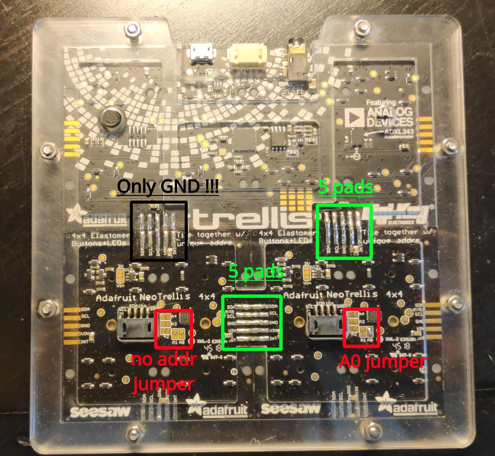

Soldering TrellisM4 with 2 Neotrellis
=====================================

Here is how to do tilled one trellis m4 and 2 neotrellis (seesaw) into a square :

1. solder the 2 neotrellis together as described `in the tutorial <https://learn.adafruit.com/adafruit-neotrellis/tiling>`_ (including pad for I2C addresses as needed).
2. solder the tilled neotrellis to the trellis :

  - every texts on the silkscreen in the same direction = the LED N°1 of the
    neotrellis and the USB port up
  - among the left pads on the bottom edge of the trellis m4 :
    solder ONLY the center one (GND)

    .. image:: _static/tilled_trellis_left_pad.jpg
       :scale: 50 %

  - solder every 5 pads on the right

    .. image:: _static/tilled_trellis_right_pad.jpg
       :scale: 50 %

Here is a picture of the full tilled board:

